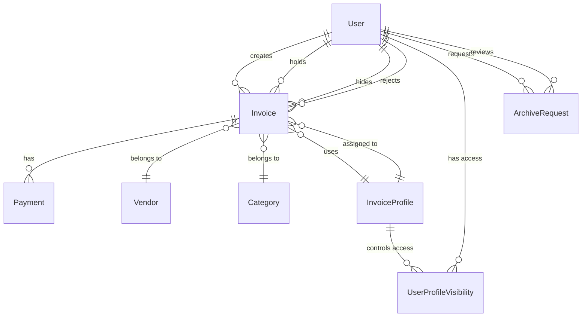
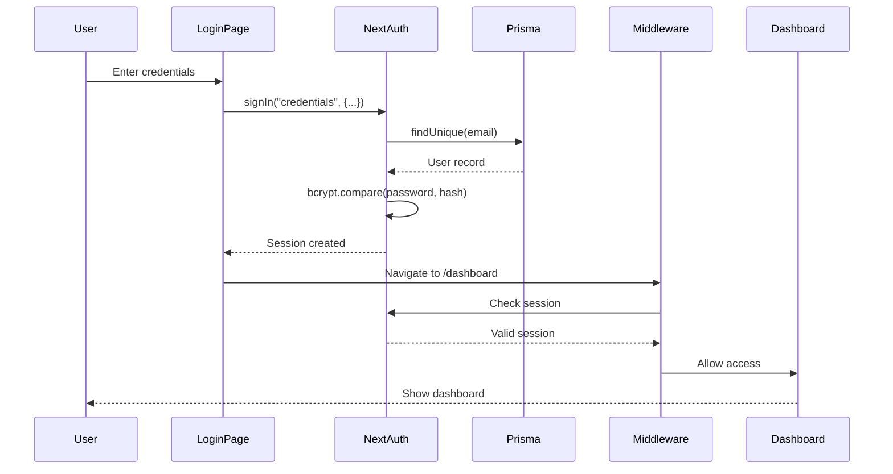
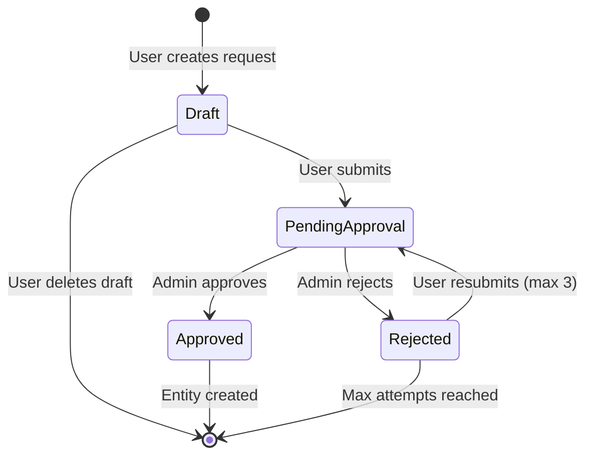

# PayLog System Architecture

## Overview

PayLog is a full-stack invoice management system built with Next.js 14 App Router, emphasizing type safety, developer experience, and production-ready patterns.

---

## Technology Stack

### Frontend
- **Framework**: Next.js 14.2.15 (App Router, React Server Components)
- **Language**: TypeScript 5.x (strict mode)
- **UI Library**: Shadcn/ui (Radix UI primitives)
- **Styling**: Tailwind CSS 3.4.1
- **Animations**: Framer Motion 11.9.0
- **Forms**: React Hook Form 7.64.0 + Zod 3.23.8
- **State Management**:
  - Client state: Zustand 4.5.5 (panel system)
  - Server state: TanStack Query 5.56.2 (data fetching)

### Backend
- **Runtime**: Node.js 18+
- **Framework**: Next.js API Routes + Server Actions
- **Database**: SQLite (development), PostgreSQL (production-ready schema)
- **ORM**: Prisma 5.20.0
- **Authentication**: NextAuth.js v5 (beta.22)
- **Password Hashing**: bcryptjs 2.4.3
- **Date Handling**: date-fns 4.1.0

### Development Tools
- **Linter**: ESLint 8
- **Formatter**: Prettier 3.3.3
- **Package Manager**: npm/pnpm
- **Database GUI**: Prisma Studio

---

## Architecture Patterns

### 1. App Router Structure

```
app/
├── (auth)/                    # Authentication route group (minimal layout)
│   ├── layout.tsx            # Auth-specific layout (centered, no sidebar)
│   └── login/page.tsx        # Login page
│
├── (dashboard)/              # Protected route group (full layout)
│   ├── layout.tsx            # Dashboard layout (sidebar + header)
│   ├── dashboard/page.tsx    # Main dashboard
│   ├── invoices/page.tsx     # Invoice list
│   ├── admin/page.tsx        # Admin panel (RBAC protected)
│   └── [other-pages]/
│
├── actions/                  # Server Actions (data mutations)
│   └── invoices.ts           # Invoice CRUD actions
│
├── api/                      # API Routes (external integrations)
│   └── auth/[...nextauth]/   # NextAuth API routes
│
├── layout.tsx                # Root layout (providers, globals)
├── page.tsx                  # Root page (redirect to dashboard)
└── globals.css               # Global styles + Tailwind directives
```

**Route Groups**: Use `(auth)` and `(dashboard)` to apply different layouts without affecting URL structure.

### 2. Component Architecture

```
components/
├── ui/                       # Shadcn/ui base components (button, input, card, etc.)
├── layout/                   # Layout components (sidebar, header)
├── auth/                     # Authentication forms
├── panels/                   # Stacked panel system
│   ├── panel-container.tsx   # Root container with overlay
│   ├── panel-level.tsx       # Individual panel component
│   ├── panel-header.tsx      # Sticky header with close button
│   ├── panel-footer.tsx      # Sticky footer with actions
│   └── panel-provider.tsx    # Panel type routing
├── invoices/                 # Invoice-specific components
│   ├── invoice-list.tsx      # Invoice table/list
│   ├── invoice-detail-panel.tsx
│   └── invoice-form-panel.tsx
└── providers/                # Context providers (React Query, Theme)
```

**Component Patterns**:
- Use `'use client'` directive only when necessary (interactivity, hooks)
- Default to React Server Components (RSC) for better performance
- Co-locate related components in feature folders

### 3. Data Flow

```
Client Component (UI)
    ↓ (user action)
Server Action (app/actions/)
    ↓ (validation with Zod)
Prisma Client (database operation)
    ↓ (SQL query)
SQLite Database
    ↓ (result)
Return to Client Component
    ↓ (React Query cache update)
UI Re-renders (optimistic updates)
```

**Key Principles**:
- **Server Actions**: All data mutations use Server Actions (not API routes)
- **React Query**: Manages server state with caching, refetching, and optimistic updates
- **Zod Validation**: Schema validation on both client and server
- **Type Safety**: Prisma generates TypeScript types for database models

### 4. State Management Strategy

| State Type | Solution | Use Case |
|-----------|----------|----------|
| Server State | TanStack Query | Invoice data, user data, async data |
| Client State (Global) | Zustand | Panel stack, UI preferences |
| Form State | React Hook Form | Form inputs, validation errors |
| URL State | Next.js useSearchParams | Filters, pagination, search |
| Session State | NextAuth | User authentication, role |

**No Redux/Context API**: Zustand for simple global state, React Query for server state.

---

## Database Schema

### Overview (14 Models)



### Key Models

#### User
```prisma
model User {
  id                Int       @id @default(autoincrement())
  email             String    @unique
  full_name         String
  password_hash     String
  role              String    @default("standard_user")
  is_active         Boolean   @default(true)
  // Roles: "standard_user", "admin", "super_admin"
}
```

#### Invoice
```prisma
model Invoice {
  id                 Int       @id @default(autoincrement())
  invoice_number     String    @unique
  invoice_amount     Float
  status             String    @default("pending_approval")
  // Status: "pending_approval", "on_hold", "unpaid", "partial", "paid", "overdue"

  // On Hold Fields
  hold_reason        String?
  hold_by            Int?
  hold_at            DateTime?

  // Resubmission Counter
  submission_count   Int       @default(1)
  last_submission_at DateTime  @default(now())

  // Hidden Invoice Feature
  is_hidden          Boolean   @default(false)
  hidden_by          Int?
  hidden_at          DateTime?
  hidden_reason      String?
}
```

#### Payment
```prisma
model Payment {
  id              Int       @id @default(autoincrement())
  invoice_id      Int
  amount_paid     Float
  payment_date    DateTime
  payment_method  String?
  status          String    @default("pending")
  // Status: "pending", "approved", "rejected"
}
```

### Indexes

Performance-critical indexes:
- `idx_invoices_status` - Fast status filtering
- `idx_invoices_hidden` - Filter hidden invoices
- `idx_invoices_submission_count` - Resubmission queries
- `idx_users_role_active` - RBAC queries
- `idx_payments_invoice` - Payment lookups

---

## Authentication Flow



### NextAuth Configuration

**File**: `lib/auth.ts`

```typescript
export const authOptions: NextAuthConfig = {
  providers: [
    Credentials({
      async authorize(credentials) {
        // 1. Validate input with Zod
        // 2. Query user by email
        // 3. Compare password hash
        // 4. Return user object
      }
    })
  ],
  callbacks: {
    jwt({ token, user }) {
      // Attach role to JWT
    },
    session({ session, token }) {
      // Attach role to session
    }
  }
}
```

### Middleware Protection

**File**: `middleware.ts`

```typescript
export default auth((req) => {
  const isLoggedIn = !!req.auth;
  const isOnDashboard = req.nextUrl.pathname.startsWith('/dashboard');

  if (isOnDashboard && !isLoggedIn) {
    return Response.redirect(new URL('/login', req.nextUrl));
  }

  if (req.nextUrl.pathname === '/login' && isLoggedIn) {
    return Response.redirect(new URL('/dashboard', req.nextUrl));
  }
});
```

**Protected Routes**: All routes under `/dashboard/*` require authentication.

---

## Panel System Architecture

### Design Philosophy

Inspired by Microsoft 365's slide-out panels:
- Stack up to 3 panels (detail → edit → confirmation)
- Slide-in from right with smooth animations
- Keyboard navigation (ESC to close)
- Responsive (full-screen on mobile)
- GPU-accelerated animations

### State Management (Zustand)

**File**: `lib/store/panel-store.ts`

```typescript
interface PanelStore {
  panels: PanelConfig[];
  openPanel: (type: string, props: Record<string, unknown>) => string;
  closePanel: (id: string) => void;
  closeTopPanel: () => void;
  closeAllPanels: () => void;
}
```

**Max Stack Depth**: 3 levels enforced in store.

### Panel Levels

| Level | Width | Use Case | Example |
|-------|-------|----------|---------|
| Level 1 | 350px | Detail view (read-only) | Invoice detail |
| Level 2 | 500px | Edit form | Invoice edit form |
| Level 3 | 500px | Confirmation dialog | Delete confirmation |

**Mobile**: All panels 100% width (full-screen).

### Animation Specifications

```typescript
// Framer Motion spring animation
const spring = {
  type: "spring",
  stiffness: 400,
  damping: 30,
  duration: 0.3
};

// Slide-in from right
initial={{ x: "100%" }}
animate={{ x: 0 }}
exit={{ x: "100%" }}
```

**Z-Index Isolation**: 10000-10003 (no conflicts with main app).

### Accessibility

- `role="dialog"` + `aria-modal="true"`
- Auto-focus on panel open
- Focus trap within active panel
- ESC key closes topmost panel
- `aria-labelledby` for screen readers

---

## Invoice Management

### Comprehensive Invoice Data Capture

PayLog captures extensive invoice information to support detailed reporting and compliance requirements:

#### Core Fields
- **Invoice Number**: Unique identifier from the invoice document
- **Vendor**: Required link to vendor directory (cannot be null)
- **Amount**: Total invoice amount
- **Dates**: Invoice date, due date

#### Period Tracking
- **Period Start/End**: Tracks the service or billing period covered by the invoice
- **Use Case**: Recurring services (e.g., "Invoice dated 2025-04-01 for services from 2025-01-01 to 2025-03-31")
- **Validation**: Application-level check ensures period_end >= period_start

#### Compliance & Classification
- **TDS Applicable**: Boolean flag for Tax Deducted at Source
  - Defaults to false
  - Can be overridden by user
  - Future enhancement: Default from invoice profile
- **Category**: Expense category for reporting
- **Sub Entity**: Links to organizational division/department/branch
- **Profile**: Invoice profile for visibility control

#### Additional Context
- **Notes**: Multi-line text field for internal notes and descriptions
- **Example**: "Invoice covers Jan-Mar maintenance fees"
- **Display**: Preserves line breaks with `whitespace-pre-wrap`

### Sub Entity (Organizational Divisions)

The SubEntity model represents organizational divisions, departments, or branches within the company:

```prisma
model SubEntity {
  id          Int      @id @default(autoincrement())
  name        String
  description String?
  is_active   Boolean  @default(true)
  created_at  DateTime @default(now())
  updated_at  DateTime @updatedAt

  invoices    Invoice[]
}
```

**Use Cases**:
- Track expenses by division
- Generate per-branch spending reports
- Filter invoices by department
- Organizational cost allocation

**Relationship**:
- One-to-Many with Invoice
- Optional foreign key (invoices can exist without sub entity)
- OnDelete: SetNull (invoices remain if sub entity deleted)

### Invoice Form Workflow

**Field Order** (optimized for data entry):
1. Invoice Profile (context setting)
2. Vendor (required, searchable)
3. Invoice Number (from document)
4. Invoice Date (from document)
5. Invoice Period (start/end dates)
6. Due Date (from document)
7. Amount (from document)
8. TDS Applicable (compliance flag)
9. Category (classification)
10. Sub Entity (organizational tracking)
11. Notes (additional context)
12. Added by (auto-filled from session)

**Validation**:
- Required: vendor_id, invoice_number, invoice_amount
- Custom: period_end >= period_start
- Warnings (non-blocking): past due dates, negative amounts

**Panel Size**: 700px wide (Level 2) for comfortable multi-field visibility

---

## Server Actions Pattern

### File Structure

**Location**: `app/actions/invoices.ts`

### Action Anatomy

```typescript
'use server';

import { auth } from '@/lib/auth';
import { prisma } from '@/lib/db';
import { createInvoiceSchema } from '@/lib/validations/invoice';

export async function createInvoice(data: unknown) {
  // 1. Authentication
  const session = await auth();
  if (!session?.user) {
    return { error: 'Unauthorized' };
  }

  // 2. Validation
  const parsed = createInvoiceSchema.safeParse(data);
  if (!parsed.success) {
    return { error: 'Validation failed', details: parsed.error };
  }

  // 3. Authorization (RBAC)
  if (session.user.role !== 'admin') {
    return { error: 'Forbidden' };
  }

  // 4. Database Operation
  try {
    const invoice = await prisma.invoice.create({
      data: {
        ...parsed.data,
        created_by: session.user.id,
      },
    });
    return { data: invoice };
  } catch (error) {
    return { error: 'Failed to create invoice' };
  }
}
```

### Error Handling

**Pattern**: Return objects with `{ data }` or `{ error }` (no throwing).

```typescript
// Client-side usage
const result = await createInvoice(formData);
if (result.error) {
  toast.error(result.error);
} else {
  toast.success('Invoice created!');
  queryClient.invalidateQueries(['invoices']);
}
```

### Why Server Actions (not API Routes)?

- Type-safe end-to-end (TypeScript inference)
- No separate API layer needed
- Built-in CSRF protection
- Simpler codebase (fewer files)
- Progressive enhancement support

---

## React Query Integration

### Query Client Setup

**File**: `components/providers/query-provider.tsx`

```typescript
const queryClient = new QueryClient({
  defaultOptions: {
    queries: {
      staleTime: 60 * 1000, // 1 minute
      retry: 1,
    },
  },
});
```

### Usage Pattern

**Example**: Invoice list with React Query

```typescript
'use client';

import { useQuery } from '@tanstack/react-query';
import { getInvoices } from '@/app/actions/invoices';

function InvoiceList() {
  const { data, isLoading, error } = useQuery({
    queryKey: ['invoices'],
    queryFn: async () => {
      const result = await getInvoices();
      if (result.error) throw new Error(result.error);
      return result.data;
    },
  });

  if (isLoading) return <Spinner />;
  if (error) return <ErrorState message={error.message} />;

  return <InvoiceTable invoices={data} />;
}
```

### Optimistic Updates

```typescript
const mutation = useMutation({
  mutationFn: updateInvoice,
  onMutate: async (newData) => {
    // Cancel outgoing queries
    await queryClient.cancelQueries({ queryKey: ['invoices'] });

    // Snapshot current data
    const previous = queryClient.getQueryData(['invoices']);

    // Optimistically update cache
    queryClient.setQueryData(['invoices'], (old) =>
      old.map((inv) => inv.id === newData.id ? newData : inv)
    );

    return { previous };
  },
  onError: (err, variables, context) => {
    // Rollback on error
    queryClient.setQueryData(['invoices'], context.previous);
  },
  onSettled: () => {
    // Refetch to ensure consistency
    queryClient.invalidateQueries({ queryKey: ['invoices'] });
  },
});
```

---

## Master Data Request Workflow

### Overview

Standard users can request new master data entities for admin approval:
- **Vendors**: Company vendors with TIN, contact info
- **Categories**: Invoice categorization types
- **Invoice Profiles**: Profile-based visibility settings
- **Payment Types**: Payment method types (check, wire, ACH, etc.)

This enables a self-service workflow where users can request entities they need, while admins maintain control over the master data catalog.

### Workflow States



**State Definitions**:

1. **Draft**: User saves request without submitting
   - User can edit or delete
   - Not visible to admins
   - Auto-saves every 30 seconds

2. **Pending Approval**: User submits, awaiting admin review
   - User cannot edit or delete
   - Visible in admin queue
   - Real-time notifications to admins

3. **Approved**: Admin approves, entity created
   - Entity immediately available in dropdowns
   - User receives email + toast notification
   - Request marked as completed

4. **Rejected**: Admin rejects with reason
   - User can resubmit with edits (max 3 attempts)
   - Rejection reason shown in detail view
   - Counter tracks attempts (1/3, 2/3, 3/3)
   - After 3 rejections, request is permanently closed

### Data Model

**Single Table Design**: `MasterDataRequest`

```prisma
model MasterDataRequest {
  id                    Int       @id @default(autoincrement())
  entity_type           String    // 'vendor', 'category', 'invoice_profile', 'payment_type'
  entity_data           String    // JSON string (SQLite compatibility)
  status                String    // 'draft', 'pending_approval', 'approved', 'rejected'

  // User tracking
  requested_by          Int
  requested_user        User      @relation("UserRequests", fields: [requested_by])

  // Admin tracking
  approved_by           Int?
  approved_user         User?     @relation("AdminApprovals", fields: [approved_by])
  rejected_by           Int?
  rejection_reason      String?

  // Resubmission chain
  resubmission_count    Int       @default(0)
  previous_attempt_id   Int?
  previous_attempt      MasterDataRequest? @relation("ResubmissionChain", fields: [previous_attempt_id])
  resubmissions         MasterDataRequest[] @relation("ResubmissionChain")

  // Admin edit tracking
  admin_edits           String?   // JSON diff of admin changes

  created_at            DateTime  @default(now())
  updated_at            DateTime  @updatedAt

  @@index([status])
  @@index([entity_type])
  @@index([requested_by])
  @@index([approved_by])
  @@index([created_at])
}
```

**Why Single Table?**
- Simplifies queries (all requests in one place)
- Consistent workflow logic across entity types
- Easier auditing and reporting
- JSON storage provides flexibility per entity type

**Entity Data JSON Format**:

```typescript
// Vendor request
{
  name: "Acme Corp",
  tin_number: "12-3456789",
  contact_email: "billing@acme.com",
  contact_phone: "555-1234"
}

// Category request
{
  name: "Office Supplies",
  description: "General office supplies and equipment"
}

// Invoice Profile request
{
  name: "Marketing Budget",
  description: "Marketing department expenses",
  visible_to_all: false
}

// Payment Type request
{
  name: "Wire Transfer",
  description: "International wire transfers"
}
```

### Key Features

#### 1. Duplicate Detection

**Algorithm**: Fuzzy string matching using Levenshtein distance

**Thresholds**:
- Vendors: 85% similarity (name matching)
- Categories: 90% similarity (higher threshold for simpler names)
- Invoice Profiles: 85% similarity
- Payment Types: 90% similarity

**Implementation**:
```typescript
// app/api/master-data/check-duplicates/route.ts
export async function POST(req: Request) {
  const { entityType, data } = await req.json();

  // Fetch existing entities
  const existing = await getExistingEntities(entityType);

  // Calculate similarity scores
  const matches = existing
    .map(entity => ({
      ...entity,
      similarity: levenshtein(data.name, entity.name)
    }))
    .filter(m => m.similarity >= getThreshold(entityType))
    .sort((a, b) => b.similarity - a.similarity);

  return Response.json({
    hasDuplicates: matches.length > 0,
    matches: matches.slice(0, 5) // Top 5 matches
  });
}
```

**User Experience**:
- Real-time duplicate checking (debounced 500ms)
- Warning modal showing potential matches
- User can override with "Create Anyway" confirmation
- Admin sees duplicate warning during review

#### 2. Admin Edit Capability

Admins can modify any field before approval:

**Edit Tracking**:
```typescript
// Original request
{
  name: "ACME Corporation",
  tin_number: "12345678"
}

// Admin edits
{
  name: "Acme Corp",  // Fixed capitalization
  tin_number: "12-3456789"  // Added hyphen
}

// Stored as JSON diff in admin_edits column
{
  name: { old: "ACME Corporation", new: "Acme Corp" },
  tin_number: { old: "12345678", new: "12-3456789" }
}
```

**Audit Trail Benefits**:
- Transparency: User sees what was changed
- Accountability: Tracks who made edits
- Learning: Users improve future requests
- Compliance: Full edit history

#### 3. Resubmission Counter

**Max 3 Attempts**:
- 1st rejection: User resubmits with changes
- 2nd rejection: User resubmits with more changes
- 3rd rejection: Request permanently closed

**Implementation**:
```typescript
export async function resubmitRequest({ requestId, updatedData }) {
  const original = await prisma.masterDataRequest.findUnique({
    where: { id: requestId }
  });

  if (original.resubmission_count >= 3) {
    return { error: 'Maximum resubmission attempts reached' };
  }

  // Create new request linked to original
  const newRequest = await prisma.masterDataRequest.create({
    data: {
      ...updatedData,
      requested_by: original.requested_by,
      previous_attempt_id: requestId,
      resubmission_count: original.resubmission_count + 1,
      status: 'pending_approval'
    }
  });

  return { data: newRequest };
}
```

**UI Indicators**:
- Badge shows attempt count: "Attempt 2 of 3"
- Final rejection shows "Max attempts reached"
- History tab shows all previous attempts

#### 4. Real-Time Notifications

**Delivery Methods**:
1. **WebSocket** (primary): Instant notifications
2. **Polling** (fallback): 10-second intervals
3. **Email**: Persistent notification

**Notification Events**:

| Event | Recipient | Channel |
|-------|-----------|---------|
| Request submitted | Admin team | WebSocket + Email |
| Request approved | Requester | WebSocket + Toast + Email |
| Request rejected | Requester | WebSocket + Toast + Email |
| Resubmission received | Admin team | WebSocket + Email |

**Toast Notification UI**:
```typescript
// Approval toast
<Toast variant="success">
  <CheckIcon /> Vendor "Acme Corp" approved!
  <Button onClick={openInvoiceForm}>Use Now</Button>
</Toast>

// Rejection toast
<Toast variant="destructive">
  <XIcon /> Request rejected: {reason}
  <Button onClick={openRequestDetail}>View Details</Button>
</Toast>
```

#### 5. Level 3 Inline Requests

**Scenario**: User is creating an invoice and needs a new vendor that doesn't exist.

**Flow**:
1. User opens invoice form (Level 2 panel)
2. Clicks "Request new vendor..." in vendor dropdown
3. Vendor request form opens in Level 3 panel
4. User fills form and submits
5. Level 3 panel closes, returns to invoice form
6. Toast: "Request submitted! You'll be notified when approved."
7. Invoice form shows pending state: "Vendor pending approval"

**Panel Stack**:
```
Level 1: Invoice Detail (read-only)
Level 2: Invoice Form (edit mode)
Level 3: Vendor Request Form (inline request)
```

**Implementation**:
```typescript
// components/invoices/invoice-form-panel.tsx
function VendorDropdown() {
  const { openPanel } = usePanel();

  return (
    <Select>
      {vendors.map(v => <SelectItem key={v.id}>{v.name}</SelectItem>)}
      <SelectSeparator />
      <SelectItem
        onClick={() => openPanel('vendor-request-form', {
          context: 'invoice',
          returnTo: 'invoice-form'
        })}
      >
        + Request new vendor...
      </SelectItem>
    </Select>
  );
}
```

### API Endpoints

**User Actions** (`app/actions/master-data-requests.ts`):
- `createRequest(entityType, data, userId)` - Create draft/pending
- `getUserRequests(userId, filters?)` - Get user's requests
- `getRequestById(requestId)` - Get single request
- `updateRequest(requestId, data)` - Update draft only
- `submitRequest(requestId)` - Change draft to pending
- `deleteRequest(requestId)` - Delete draft only
- `resubmitRequest(requestId, updatedData)` - Resubmit rejected

**Admin Actions** (`app/actions/admin/master-data-approval.ts`):
- `getAdminRequests(filters)` - Get pending requests
- `approveRequest(requestId, adminEdits?)` - Approve with edits
- `rejectRequest(requestId, reason)` - Reject with reason
- `bulkApprove(requestIds)` - Approve multiple
- `bulkReject(requestIds, reason)` - Reject multiple

**Duplicate Detection** (`app/api/master-data/check-duplicates/route.ts`):
- `POST /api/master-data/check-duplicates`
- Request: `{ entityType, data: { name } }`
- Response: `{ hasDuplicates: boolean, matches: Entity[] }`

### Integration with Sprint 2 Panel System

**Panel Levels**:
- **Level 1**: Request detail view (read-only)
- **Level 2**: Request forms (create/edit)
- **Level 3**: Inline requests from invoice/payment forms

**Benefits**:
- Consistent UX with invoice CRUD
- No modal z-index conflicts
- Keyboard navigation (ESC closes top panel)
- GPU-accelerated animations
- Mobile-responsive (full-screen on mobile)

### Security Considerations

**Authorization**:
- Standard users: Create and view own requests only
- Admins: View all requests, approve/reject
- Super admins: View all requests, approve/reject, delete

**Validation**:
- Zod schemas for all entity types
- SQL injection prevention (Prisma parameterized queries)
- XSS prevention (React auto-escaping)
- Rate limiting: 10 requests per user per hour

**Audit Trail**:
- All actions logged (create, submit, approve, reject)
- Admin edits tracked with JSON diff
- Resubmission chain preserved
- Email notifications archived (90-day retention)

---

## Role-Based Access Control (RBAC)

### Role Hierarchy

1. **standard_user**: Create invoices, view own invoices
2. **admin**: Approve/reject invoices, manage vendors/categories
3. **super_admin**: User management, system configuration, archive approvals

### RBAC Implementation

#### Server-Side (Server Actions)

```typescript
export async function approveInvoice(invoiceId: number) {
  const session = await auth();

  if (!session?.user) {
    return { error: 'Unauthorized' };
  }

  if (!['admin', 'super_admin'].includes(session.user.role)) {
    return { error: 'Forbidden: Admin access required' };
  }

  // Proceed with approval...
}
```

#### Client-Side (UI Visibility)

```typescript
'use client';

import { useSession } from 'next-auth/react';

function InvoiceActions({ invoice }) {
  const { data: session } = useSession();
  const isAdmin = ['admin', 'super_admin'].includes(session?.user?.role);

  return (
    <>
      <Button>View</Button>
      {isAdmin && (
        <>
          <Button>Approve</Button>
          <Button>Reject</Button>
        </>
      )}
    </>
  );
}
```

#### Middleware-Level (Page Access)

```typescript
// app/(dashboard)/admin/page.tsx
import { auth } from '@/lib/auth';
import { redirect } from 'next/navigation';

export default async function AdminPage() {
  const session = await auth();

  if (session?.user?.role !== 'super_admin') {
    redirect('/dashboard');
  }

  return <AdminPanel />;
}
```

---

## File Structure

```
paylog-3/
├── app/                          # Next.js App Router
│   ├── (auth)/                   # Auth route group
│   │   ├── layout.tsx            # Centered layout for login
│   │   └── login/page.tsx        # Login page
│   ├── (dashboard)/              # Dashboard route group
│   │   ├── layout.tsx            # Sidebar + header layout
│   │   ├── dashboard/page.tsx    # Main dashboard
│   │   ├── invoices/page.tsx     # Invoice list
│   │   ├── admin/page.tsx        # Admin panel
│   │   ├── settings/page.tsx     # User settings
│   │   └── reports/page.tsx      # Reports
│   ├── actions/                  # Server Actions
│   │   └── invoices.ts           # Invoice CRUD
│   ├── api/                      # API Routes
│   │   └── auth/[...nextauth]/   # NextAuth
│   ├── layout.tsx                # Root layout (providers)
│   ├── page.tsx                  # Root redirect
│   └── globals.css               # Global styles
│
├── components/                   # React components
│   ├── ui/                       # Shadcn/ui components
│   ├── layout/                   # Sidebar, header
│   ├── panels/                   # Stacked panel system
│   ├── invoices/                 # Invoice components
│   ├── auth/                     # Login form
│   └── providers/                # React Query provider
│
├── hooks/                        # Custom React hooks
│   ├── use-panel.ts              # Panel operations
│   ├── use-panel-stack.ts        # Panel state
│   └── use-toast.ts              # Toast notifications
│
├── lib/                          # Utility libraries
│   ├── auth.ts                   # NextAuth config
│   ├── db.ts                     # Prisma client
│   ├── utils.ts                  # Helper functions
│   ├── store/                    # Zustand stores
│   │   └── panel-store.ts        # Panel state
│   └── validations/              # Zod schemas
│       ├── auth.ts               # Login validation
│       └── invoice.ts            # Invoice validation
│
├── types/                        # TypeScript definitions
│   ├── panel.ts                  # Panel types
│   ├── invoice.ts                # Invoice types
│   └── next-auth.d.ts            # NextAuth augmentation
│
├── prisma/                       # Prisma ORM
│   └── seed.ts                   # Database seed script
│
├── schema.prisma                 # Database schema (root)
├── middleware.ts                 # Route protection
├── .env                          # Environment variables
├── package.json                  # Dependencies
├── tsconfig.json                 # TypeScript config
├── tailwind.config.ts            # Tailwind config
└── next.config.mjs               # Next.js config
```

---

## Performance Considerations

### Database
- **Indexes**: Created on high-query fields (status, role, etc.)
- **Eager Loading**: Use `include` in Prisma to prevent N+1 queries
- **Pagination**: Implement cursor-based pagination for large lists

### Frontend
- **Code Splitting**: Dynamic imports for heavy components
- **Image Optimization**: Next.js `<Image>` component
- **React Query Caching**: 1-minute stale time reduces API calls
- **Optimistic Updates**: Instant UI feedback

### Animations
- **GPU Acceleration**: `transform` and `opacity` only
- **Framer Motion**: Hardware-accelerated animations
- **Debouncing**: Search inputs debounced (300ms)

---

## Security

### Authentication
- Password hashing with bcrypt (10 rounds)
- JWT session tokens with NextAuth
- HTTP-only cookies for session storage
- CSRF protection built into Server Actions

### Authorization
- Role-based access control (3 levels)
- Server-side permission checks (never trust client)
- Protected API routes with session validation

### Data Validation
- Zod schemas on client and server
- SQL injection prevention (Prisma parameterized queries)
- XSS prevention (React auto-escaping)

### Database
- Soft deletes (archive requests)
- Audit trail (created_by, updated_at)
- Cascade deletes for related records
- Last super admin protection (trigger)

---

## Deployment

### Environment Variables

**Required**:
```bash
DATABASE_URL="file:./dev.db"               # SQLite (dev)
NEXTAUTH_URL="http://localhost:3000"       # App URL
NEXTAUTH_SECRET="<random-string>"          # JWT secret
```

**Production**:
```bash
DATABASE_URL="postgresql://..."            # PostgreSQL
NEXTAUTH_URL="https://paylog.example.com"
NODE_ENV="production"
```

### Build Process

```bash
# Install dependencies
npm install

# Generate Prisma Client
npm run db:generate

# Run migrations
npm run db:migrate

# Seed database (optional)
npm run db:seed

# Build for production
npm run build

# Start production server
npm start
```

### Deployment Platforms

**Recommended**: Railway, Vercel, or Docker

- **Railway**: Automatic PostgreSQL provisioning
- **Vercel**: Edge functions, global CDN
- **Docker**: Full control, self-hosted

---

## Testing Strategy (Sprint 12)

### Unit Tests
- Server Actions validation logic
- Utility functions
- Custom hooks

### Integration Tests
- API route testing
- Database operations
- Authentication flow

### E2E Tests
- Login → Create Invoice → Approve → Pay
- Multi-panel interactions
- Role-based access control

**Tool Recommendations**: Vitest (unit), Playwright (E2E)

---

## Future Enhancements

### Phase 2 (Post-Sprint 12)
- **Real-time Updates**: WebSocket notifications
- **Multi-tenant Support**: Organization isolation
- **Advanced Reporting**: Custom report builder
- **Mobile App**: React Native companion app
- **API for Integrations**: REST/GraphQL API

### Infrastructure
- **Redis Caching**: Session storage, query cache
- **S3 Storage**: Invoice attachments (Sprint 6)
- **Email Service**: Transactional emails (Sprint 5)
- **Monitoring**: Sentry, LogRocket, Datadog

---

## Conclusion

PayLog's architecture emphasizes:
- **Type Safety**: TypeScript + Prisma + Zod end-to-end
- **Developer Experience**: Fast feedback loops, hot reload
- **Scalability**: React Query caching, indexed queries
- **Maintainability**: Clear separation of concerns, co-located files
- **Production-Ready**: RBAC, audit trails, error handling
- **Comprehensive Data Capture**: 12-field invoice forms with period tracking and compliance flags

**Current Status**: Sprint 2 complete (20.7% of total project, 37/179 SP)
**Next Milestone**: Sprint 3 (Payments & Workflow Transitions)
