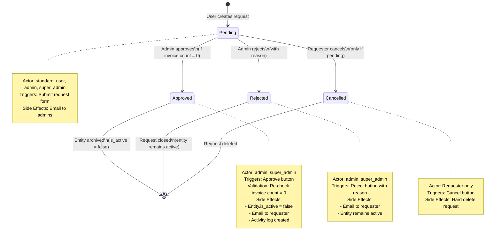
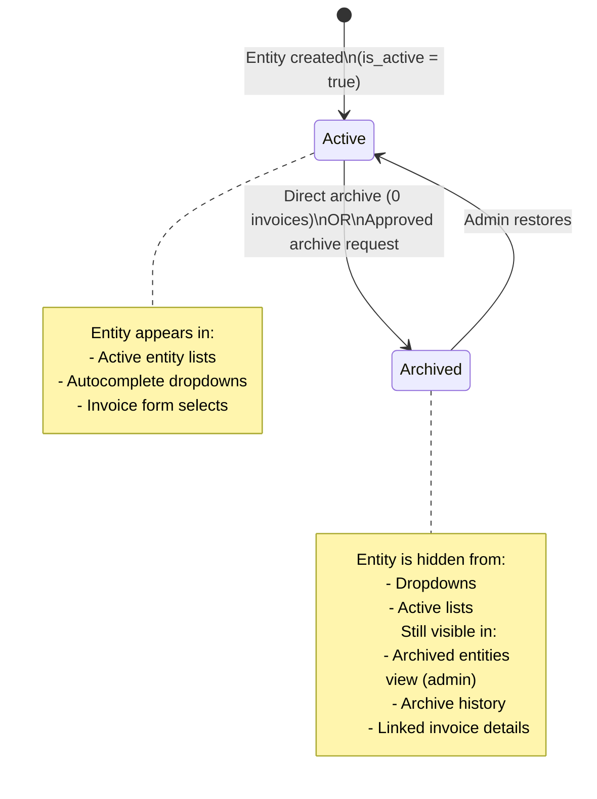

# Sprint 9: Archive Request Workflow - Requirements Specification

**Generated**: 2025-10-16
**Story Points**: 11 SP
**Status**: Requirements Complete

---

## Executive Summary

Sprint 9 implements an archive request approval workflow for master data entities (Vendor, Category, Profile, PaymentType). The workflow distinguishes between entities with zero invoices (direct archive, admin-only) and entities with linked invoices (requires approval). Standard users and admins can request archives with justification reasons; admins review and approve/reject requests. The system prevents data loss by blocking archival of entities with active invoices, enforces email notifications at key state transitions, and provides audit trails. The existing ArchiveRequest table (schema.prisma:277-300) will be reused. Any admin or super_admin can restore archived entities.

---

## 1. User Stories with Acceptance Criteria

### US1: Standard User Requests Archive for Entity with Invoices

**User Story**:
As a standard user, I want to request archive approval for a vendor/category/profile/payment type that has linked invoices, so that an admin can review and approve the archive action.

**Acceptance Criteria**:

**Given** a standard user is viewing a vendor/category/profile/payment type detail
**And** the entity has >0 linked invoices
**When** the user clicks "Request Archive"
**Then** a request form opens with:
- Entity name and type (read-only)
- Invoice count badge (e.g., "3 invoices linked")
- Reason textarea (required, 10-500 chars, with character counter)
- Warning: "This entity has linked invoices. Admin approval required."
- "Submit Request" button

**And when** the form is submitted with valid reason
**Then** an ArchiveRequest record is created with status="pending"
**And** the entity's archive button shows a pending badge ("Request Pending")
**And** an email notification is sent to all admins (ADMIN_EMAILS env var)
**And** a success toast appears: "Archive request submitted. An admin will review soon."

**Edge Cases**:
- **Empty reason**: Show validation error "Reason is required (min 10 chars)"
- **Duplicate request exists**: Show error "An archive request for this entity is already pending"
- **Entity deleted during submission**: Return 404 error "Entity not found"
- **User lacks permission**: Return 403 error "You do not have permission to request archive"

**RBAC**:
- standard_user, admin, super_admin can create archive requests
- Requests always start with status="pending" (no draft state)

**Negative Cases**:
- User CANNOT directly archive entity with >0 invoices
- User CANNOT bypass approval workflow
- User CANNOT edit or delete a request after submission (can only cancel if pending)

---

### US2: Admin Archives Entity with 0 Invoices Directly

**User Story**:
As an admin, I want to directly archive a vendor/category/profile/payment type that has zero invoices, so that I can quickly clean up unused master data without approval workflow.

**Acceptance Criteria**:

**Given** an admin is viewing a vendor/category/profile/payment type detail
**And** the entity has 0 linked invoices
**When** the admin clicks "Archive" button
**Then** a confirmation dialog appears:
- Title: "Archive [Entity Name]?"
- Message: "This entity has no linked invoices and will be archived immediately."
- Warning: "Archived entities will be hidden from dropdowns but can be restored later."
- "Confirm Archive" button (destructive style) + "Cancel" button

**And when** admin confirms
**Then** the entity's is_active field is set to false
**And** the entity disappears from active entity lists and dropdowns
**And** a success toast appears: "[Entity Name] archived successfully"
**And** an activity log entry is created (action="archived")
**And** NO email notification is sent (direct action, not approval workflow)

**Edge Cases**:
- **Entity gains invoices after button click**: Re-validate invoice count on confirmation; if count >0, show error "Cannot archive: entity now has linked invoices. Please create an archive request instead."
- **Entity already archived**: Show error "Entity is already archived"
- **Network error during archive**: Rollback transaction, keep entity active, show error toast

**RBAC**:
- Only admin or super_admin can directly archive
- standard_user sees "Request Archive" button instead (triggers US1)

**Negative Cases**:
- Admin CANNOT directly archive entity with >0 invoices (must use approval workflow)
- Admin CANNOT archive entity that is already archived

---

### US3: Admin Views Pending Archive Requests

**User Story**:
As an admin, I want to view a list of all pending archive requests with filters, so that I can prioritize and review them efficiently.

**Acceptance Criteria**:

**Given** an admin navigates to Admin Dashboard
**And** clicks "Archive Requests" section
**When** the page loads
**Then** a table displays all pending archive requests with columns:
- Request ID (numeric, sortable)
- Entity Type (icon + label: Vendor/Category/Profile/PaymentType)
- Entity Name (clickable, opens detail panel)
- Requester Name (with avatar or initials)
- Reason (truncated to 100 chars, hover shows full text)
- Invoice Count (badge with number)
- Requested Date (relative time: "2 days ago")
- Actions (Approve/Reject buttons)

**And** a sidebar counter badge shows pending request count (red dot)
**And** filters are available:
- Entity Type (dropdown: All, Vendor, Category, Profile, PaymentType)
- Requested Date Range (date pickers)
- Requester (searchable dropdown)

**And** pagination controls for >20 requests
**And** sort options: Requested Date (newest first by default), Entity Type, Invoice Count

**Edge Cases**:
- **No pending requests**: Show empty state with illustration and message "No pending archive requests. All caught up!"
- **Stale request (entity deleted)**: Show greyed-out row with warning icon "Entity no longer exists"
- **Requester deactivated**: Show "Inactive User" label with strikethrough

**RBAC**:
- Only admin or super_admin can view archive requests page
- standard_user does NOT see sidebar badge or archive requests section

**Negative Cases**:
- standard_user CANNOT access archive requests page (403 Forbidden)
- Approved/rejected requests do NOT appear in pending list (separate history view)

---

### US4: Admin Approves Archive Request

**User Story**:
As an admin, I want to approve an archive request after reviewing the justification, so that the entity can be safely archived with audit trail.

**Acceptance Criteria**:

**Given** an admin is viewing a pending archive request
**When** the admin clicks "Approve" button
**Then** a confirmation dialog appears:
- Title: "Approve Archive Request for [Entity Name]?"
- Message: "Approving will set this entity to inactive. It will be hidden from dropdowns but can be restored later."
- Metadata display:
  - Requester: [Name]
  - Reason: [Full text]
  - Invoice Count: [Current count]
- Admin notes textarea (optional, 0-500 chars): "Add notes for audit trail (optional)"
- "Approve & Archive" button (destructive) + "Cancel" button

**And when** admin confirms approval
**Then** the following atomic transaction occurs:
1. Re-validate entity exists and invoice count is 0
2. If invoice count >0, abort and show error: "Cannot archive: Entity now has [count] linked invoice(s). Please review and reject this request."
3. If invoice count = 0:
   - Update entity: is_active = false
   - Update ArchiveRequest: status = "approved", reviewed_by = admin.id, reviewed_at = now()
   - Create activity log: action = "archive_approved", old_data = {is_active: true}, new_data = {is_active: false}
   - Send email to requester (approval notification template)
   - Revalidate paths: /settings, /invoices, /admin
   - Return success

**And** the request disappears from pending list
**And** the entity is excluded from active dropdowns
**And** a success toast appears: "Archive request approved. [Entity Name] is now archived."

**Edge Cases**:
- **Entity gains invoices during review**: Transaction aborts with error (see step 2 above)
- **Request already reviewed**: Show error "This request has already been processed"
- **Entity deleted**: Show error "Entity no longer exists. Rejecting request."
- **Email send fails**: Log error, do NOT rollback transaction (fire-and-forget pattern)
- **Multiple admins approve simultaneously**: Last-write-wins; second approval shows error "Request already approved"

**RBAC**:
- Only admin or super_admin can approve
- Requester CANNOT approve their own request (enforced client-side and server-side)

**Negative Cases**:
- Admin CANNOT approve request if entity has >0 invoices (validation blocks approval)
- Admin CANNOT approve request that is already approved/rejected
- standard_user CANNOT approve requests

---

### US5: Admin Rejects Archive Request

**User Story**:
As an admin, I want to reject an archive request with a reason, so that the requester understands why their request was denied and can resubmit if needed.

**Acceptance Criteria**:

**Given** an admin is viewing a pending archive request
**When** the admin clicks "Reject" button
**Then** a rejection reason modal appears:
- Title: "Reject Archive Request for [Entity Name]"
- Message: "Please provide a reason for rejection. The requester will receive an email notification."
- Metadata display:
  - Requester: [Name]
  - Reason: [Full archive request reason]
- Rejection reason textarea (required, 10-500 chars, with character counter)
- "Reject Request" button (destructive) + "Cancel" button

**And when** admin submits rejection with valid reason
**Then** the ArchiveRequest record is updated:
- status = "rejected"
- rejection_reason = [admin input]
- reviewed_by = admin.id
- reviewed_at = now()

**And** an email notification is sent to requester (rejection notification template)
**And** the request disappears from pending list
**And** the entity remains active (is_active = true)
**And** the entity's archive button shows normal state (no pending badge)
**And** a success toast appears: "Archive request rejected. Requester has been notified."

**Edge Cases**:
- **Empty rejection reason**: Show validation error "Rejection reason is required (min 10 chars)"
- **Request already reviewed**: Show error "This request has already been processed"
- **Entity deleted**: Allow rejection to proceed (orphaned request cleanup)
- **Email send fails**: Log error, do NOT rollback transaction (fire-and-forget pattern)

**RBAC**:
- Only admin or super_admin can reject
- Requester CANNOT reject their own request

**Negative Cases**:
- Admin CANNOT reject without providing a reason
- Admin CANNOT reject request that is already approved/rejected
- Rejection does NOT archive the entity (entity remains active)

---

### US6: User Cancels Own Pending Archive Request

**User Story**:
As a user, I want to cancel my pending archive request before admin reviews it, so that I can withdraw a mistaken or no-longer-needed request.

**Acceptance Criteria**:

**Given** a user is viewing an entity detail page
**And** the user has a pending archive request for this entity
**When** the user clicks "Cancel Request" button
**Then** a confirmation dialog appears:
- Title: "Cancel Archive Request?"
- Message: "This will withdraw your pending archive request for [Entity Name]. You can create a new request later if needed."
- "Cancel Request" button + "Keep Request" button

**And when** user confirms cancellation
**Then** the ArchiveRequest record is deleted (hard delete, not status change)
**And** the entity's archive button returns to normal state
**And** a success toast appears: "Archive request cancelled"
**And** NO email notification is sent (user action, no admin involvement)

**Edge Cases**:
- **Request already reviewed**: Show error "Cannot cancel: request has already been reviewed by an admin"
- **Request does not exist**: Show error "No pending archive request found"
- **User tries to cancel another user's request**: Return 403 error "You can only cancel your own requests"

**RBAC**:
- User can only cancel their own pending requests
- admin/super_admin can cancel any pending request (via rejection workflow)

**Negative Cases**:
- User CANNOT cancel approved/rejected requests (history is immutable)
- User CANNOT cancel another user's pending request

---

### US7: Admin Restores Archived Entity

**User Story**:
As an admin, I want to restore an archived vendor/category/profile/payment type, so that it becomes active again and appears in dropdowns.

**Acceptance Criteria**:

**Given** an admin is viewing archived entities list (filtered view: is_active = false)
**When** the admin clicks "Restore" button on an archived entity
**Then** a confirmation dialog appears:
- Title: "Restore [Entity Name]?"
- Message: "This will reactivate the entity and make it available in dropdowns."
- Metadata display:
  - Archived Date: [timestamp]
  - Archived By: [Admin name if available]
- "Restore Entity" button + "Cancel" button

**And when** admin confirms restoration
**Then** the entity's is_active field is set to true
**And** the entity appears in active entity lists and dropdowns
**And** an activity log entry is created (action="restored")
**And** a success toast appears: "[Entity Name] restored successfully"
**And** NO email notification is sent (admin action)

**Edge Cases**:
- **Entity already active**: Show error "Entity is already active"
- **Entity deleted**: Show error "Entity not found"
- **Network error**: Rollback transaction, show error toast

**RBAC**:
- admin or super_admin can restore (per architecture decision: Option B)
- standard_user CANNOT restore (403 Forbidden)

**Negative Cases**:
- standard_user CANNOT restore archived entities
- Restoring does NOT create a new archive request (direct action)

---

### US8: User Views Archive History for Entity

**User Story**:
As a user or admin, I want to view the archive request history for a specific entity, so that I can understand past archive attempts and decisions.

**Acceptance Criteria**:

**Given** a user is viewing an entity detail page
**When** the user clicks "Archive History" link (collapsed section or panel)
**Then** a timeline view displays all archive requests for this entity, ordered by requested_at DESC, showing:
- Request ID
- Status badge (Pending/Approved/Rejected)
- Requester name and avatar
- Requested Date (relative time)
- Reason (truncated, expandable)
- Reviewer name (if reviewed)
- Reviewed Date (if reviewed)
- Rejection Reason (if rejected)
- Admin Notes (if provided during approval)

**And** each request is color-coded:
- Pending: Blue border
- Approved: Green border
- Rejected: Red border

**And** pagination for >10 requests
**And** empty state: "No archive requests for this entity"

**Edge Cases**:
- **Entity never archived**: Show empty state
- **Requester/reviewer deactivated**: Show "Inactive User" label
- **Request orphaned (entity deleted)**: Show warning icon with tooltip "Entity no longer exists"

**RBAC**:
- All authenticated users can view archive history (read-only)
- standard_user can only see history for entities they have access to

**Negative Cases**:
- User CANNOT edit or delete historical requests
- User CANNOT create archive request from history view (must use entity detail page)

---

## 2. State Machine Definition

### Archive Request Lifecycle States



### State Transition Matrix

| From State | To State | Actor | Trigger | Validation | Side Effects |
|------------|----------|-------|---------|------------|--------------|
| (None) | Pending | standard_user, admin, super_admin | Submit archive request form | - Entity exists<br>- No duplicate pending request<br>- Reason 10-500 chars | - Create ArchiveRequest (status="pending")<br>- Email to all admins<br>- Show pending badge |
| Pending | Approved | admin, super_admin | Click Approve button | - Entity exists<br>- Invoice count = 0<br>- Request status = "pending" | - Set Entity.is_active = false<br>- Update request: status="approved", reviewed_by, reviewed_at<br>- Email to requester<br>- Activity log (action="archive_approved")<br>- Revalidate paths |
| Pending | Rejected | admin, super_admin | Submit rejection reason | - Rejection reason 10-500 chars<br>- Request status = "pending" | - Update request: status="rejected", rejection_reason, reviewed_by, reviewed_at<br>- Email to requester<br>- Entity remains active |
| Pending | Cancelled | Requester (or admin) | Click Cancel button | - Request status = "pending"<br>- User is requester OR admin | - Hard delete ArchiveRequest<br>- No email sent |

### Entity Archive/Restore State Machine (Separate from Archive Request)



---

## 3. API Contract Definitions

### 3.1 createArchiveRequest

**Function Signature**:
```typescript
export async function createArchiveRequest(
  data: {
    entity_type: 'vendor' | 'category' | 'invoice_profile' | 'payment_type';
    entity_id: number;
    reason: string;
  }
): Promise<ServerActionResult<ArchiveRequest>>
```

**Input Validation (Zod Schema)**:
```typescript
const createArchiveRequestSchema = z.object({
  entity_type: z.enum(['vendor', 'category', 'invoice_profile', 'payment_type']),
  entity_id: z.number().int().positive(),
  reason: z.string().min(10, 'Reason must be at least 10 characters').max(500, 'Reason must not exceed 500 characters').trim(),
});
```

**Output Format**:
```typescript
type ServerActionResult<T> =
  | { success: true; data: T }
  | { success: false; error: string };

type ArchiveRequest = {
  id: number;
  entity_type: string;
  entity_id: number;
  requested_by: number;
  status: string;
  reason: string;
  requested_at: Date;
};
```

**RBAC Requirements**:
- User must be authenticated
- Roles allowed: standard_user, admin, super_admin

**Side Effects**:
1. Check entity exists (query Vendor/Category/InvoiceProfile/PaymentType by id)
2. Check for duplicate pending request (query ArchiveRequest where entity_type, entity_id, status="pending")
3. Create ArchiveRequest record with status="pending", requested_by=current_user.id
4. Send email to all admins (fire-and-forget, do not block transaction)
5. Revalidate paths: /settings, /admin

**Error Scenarios**:
- 401 Unauthorized: User not authenticated
- 404 Not Found: Entity does not exist
- 409 Conflict: Duplicate pending request exists
- 400 Bad Request: Validation error (reason too short/long)
- 500 Internal Server Error: Database transaction failed

**Example Usage**:
```typescript
const result = await createArchiveRequest({
  entity_type: 'vendor',
  entity_id: 123,
  reason: 'This vendor is no longer in business and we should clean up our records.',
});

if (result.success) {
  toast.success('Archive request submitted');
} else {
  toast.error(result.error);
}
```

---

### 3.2 getArchiveRequests

**Function Signature**:
```typescript
export async function getArchiveRequests(
  filters?: {
    status?: 'pending' | 'approved' | 'rejected';
    entity_type?: 'vendor' | 'category' | 'invoice_profile' | 'payment_type';
    requested_by?: number;
    start_date?: Date;
    end_date?: Date;
    page?: number;
    per_page?: number;
  }
): Promise<ServerActionResult<{
  requests: ArchiveRequestWithDetails[];
  pagination: {
    page: number;
    per_page: number;
    total: number;
    total_pages: number;
  };
}>>
```

**Input Validation (Zod Schema)**:
```typescript
const getArchiveRequestsSchema = z.object({
  status: z.enum(['pending', 'approved', 'rejected']).optional(),
  entity_type: z.enum(['vendor', 'category', 'invoice_profile', 'payment_type']).optional(),
  requested_by: z.number().int().positive().optional(),
  start_date: z.date().optional(),
  end_date: z.date().optional(),
  page: z.number().int().positive().default(1),
  per_page: z.number().int().positive().max(100).default(20),
});
```

**Output Format**:
```typescript
type ArchiveRequestWithDetails = {
  id: number;
  entity_type: string;
  entity_id: number;
  entity_name: string; // Joined from Vendor/Category/etc
  entity_invoice_count: number; // Current count, not historical
  status: string;
  reason: string;
  rejection_reason: string | null;
  requested_by: number;
  requester_name: string; // Joined from User
  requester_email: string;
  reviewed_by: number | null;
  reviewer_name: string | null; // Joined from User
  requested_at: Date;
  reviewed_at: Date | null;
};
```

**RBAC Requirements**:
- admin or super_admin only (standard_user cannot view)

**Side Effects**:
- None (read-only operation)

**Error Scenarios**:
- 401 Unauthorized: User not authenticated
- 403 Forbidden: User is not admin/super_admin
- 400 Bad Request: Invalid filter parameters

**Example Usage**:
```typescript
const result = await getArchiveRequests({
  status: 'pending',
  page: 1,
  per_page: 20,
});

if (result.success) {
  console.log(`Found ${result.data.pagination.total} pending requests`);
}
```

---

### 3.3 getArchiveRequestById

**Function Signature**:
```typescript
export async function getArchiveRequestById(
  requestId: number
): Promise<ServerActionResult<ArchiveRequestWithDetails>>
```

**Input Validation**:
```typescript
z.number().int().positive()
```

**Output Format**: Same as `ArchiveRequestWithDetails` above

**RBAC Requirements**:
- admin or super_admin can view any request
- standard_user can only view their own requests (check requested_by = user.id)

**Side Effects**: None (read-only)

**Error Scenarios**:
- 401 Unauthorized: User not authenticated
- 403 Forbidden: standard_user trying to view another user's request
- 404 Not Found: Request does not exist

---

### 3.4 cancelArchiveRequest

**Function Signature**:
```typescript
export async function cancelArchiveRequest(
  requestId: number
): Promise<ServerActionResult<void>>
```

**Input Validation**:
```typescript
z.number().int().positive()
```

**Output Format**:
```typescript
ServerActionResult<void> // data: undefined on success
```

**RBAC Requirements**:
- Requester can cancel their own pending request
- admin/super_admin can cancel any pending request

**Side Effects**:
1. Verify request exists and status="pending"
2. Verify user is requester OR admin
3. Hard delete ArchiveRequest record
4. Revalidate paths: /settings, /admin

**Error Scenarios**:
- 401 Unauthorized: User not authenticated
- 403 Forbidden: User is not requester and not admin
- 404 Not Found: Request does not exist
- 409 Conflict: Request is not pending (already reviewed)

---

### 3.5 approveArchiveRequest

**Function Signature**:
```typescript
export async function approveArchiveRequest(
  requestId: number,
  adminNotes?: string
): Promise<ServerActionResult<void>>
```

**Input Validation**:
```typescript
const approveArchiveRequestSchema = z.object({
  requestId: z.number().int().positive(),
  adminNotes: z.string().max(500).trim().optional(),
});
```

**Output Format**:
```typescript
ServerActionResult<void>
```

**RBAC Requirements**:
- admin or super_admin only
- User CANNOT approve their own request (validation check)

**Side Effects** (Atomic Transaction):
1. Load ArchiveRequest with entity details
2. Verify request exists and status="pending"
3. Verify entity exists (query by entity_type and entity_id)
4. Re-validate invoice count = 0 (time-of-use validation)
5. If invoice count >0, abort with error
6. Update entity: is_active = false
7. Update ArchiveRequest: status="approved", reviewed_by=admin.id, reviewed_at=now()
8. Create ActivityLog: action="archive_approved", old_data={is_active:true}, new_data={is_active:false}
9. Send email to requester (fire-and-forget)
10. Revalidate paths: /settings, /invoices, /admin

**Error Scenarios**:
- 401 Unauthorized: User not authenticated
- 403 Forbidden: User is not admin/super_admin
- 404 Not Found: Request or entity does not exist
- 409 Conflict: Request is not pending OR entity has >0 invoices
- 422 Unprocessable Entity: User trying to approve own request
- 500 Internal Server Error: Transaction failed

**Example Usage**:
```typescript
const result = await approveArchiveRequest(456, 'Approved after verifying vendor is defunct');

if (result.success) {
  toast.success('Archive request approved');
} else {
  toast.error(result.error);
}
```

---

### 3.6 rejectArchiveRequest

**Function Signature**:
```typescript
export async function rejectArchiveRequest(
  requestId: number,
  rejectionReason: string
): Promise<ServerActionResult<void>>
```

**Input Validation**:
```typescript
const rejectArchiveRequestSchema = z.object({
  requestId: z.number().int().positive(),
  rejectionReason: z.string().min(10, 'Rejection reason must be at least 10 characters').max(500).trim(),
});
```

**Output Format**:
```typescript
ServerActionResult<void>
```

**RBAC Requirements**:
- admin or super_admin only

**Side Effects**:
1. Load ArchiveRequest
2. Verify request exists and status="pending"
3. Update ArchiveRequest: status="rejected", rejection_reason, reviewed_by=admin.id, reviewed_at=now()
4. Send email to requester (fire-and-forget)
5. Revalidate paths: /settings, /admin

**Error Scenarios**:
- 401 Unauthorized: User not authenticated
- 403 Forbidden: User is not admin/super_admin
- 404 Not Found: Request does not exist
- 409 Conflict: Request is not pending
- 400 Bad Request: Rejection reason too short/long

---

### 3.7 restoreArchivedEntity

**Function Signature**:
```typescript
export async function restoreArchivedEntity(
  entityType: 'vendor' | 'category' | 'invoice_profile' | 'payment_type',
  entityId: number
): Promise<ServerActionResult<void>>
```

**Input Validation**:
```typescript
const restoreArchivedEntitySchema = z.object({
  entityType: z.enum(['vendor', 'category', 'invoice_profile', 'payment_type']),
  entityId: z.number().int().positive(),
});
```

**Output Format**:
```typescript
ServerActionResult<void>
```

**RBAC Requirements**:
- admin or super_admin only

**Side Effects**:
1. Verify entity exists
2. Verify entity is archived (is_active = false)
3. Update entity: is_active = true
4. Create ActivityLog: action="restored", old_data={is_active:false}, new_data={is_active:true}
5. Revalidate paths: /settings, /invoices

**Error Scenarios**:
- 401 Unauthorized: User not authenticated
- 403 Forbidden: User is not admin/super_admin
- 404 Not Found: Entity does not exist
- 409 Conflict: Entity is already active

---

### 3.8 getEntityArchiveHistory

**Function Signature**:
```typescript
export async function getEntityArchiveHistory(
  entityType: 'vendor' | 'category' | 'invoice_profile' | 'payment_type',
  entityId: number,
  page?: number,
  per_page?: number
): Promise<ServerActionResult<{
  requests: ArchiveRequestWithDetails[];
  pagination: {
    page: number;
    per_page: number;
    total: number;
    total_pages: number;
  };
}>>
```

**Input Validation**:
```typescript
const getEntityArchiveHistorySchema = z.object({
  entityType: z.enum(['vendor', 'category', 'invoice_profile', 'payment_type']),
  entityId: z.number().int().positive(),
  page: z.number().int().positive().default(1),
  per_page: z.number().int().positive().max(50).default(10),
});
```

**Output Format**: Same as `getArchiveRequests` response

**RBAC Requirements**:
- All authenticated users can view (read-only)

**Side Effects**: None (read-only)

**Error Scenarios**:
- 401 Unauthorized: User not authenticated
- 404 Not Found: Entity does not exist

---

## 4. Edge Cases & Error Handling

| Scenario | Resolution |
|----------|-----------|
| Entity gains invoices after request created | Re-validate invoice count during approval. If count >0, abort approval with error: "Cannot archive: Entity now has [count] linked invoice(s). Please reject this request." |
| Entity deleted while request pending | Approval: Show error "Entity no longer exists. Rejecting request."<br>Rejection: Allow rejection to proceed (orphaned request cleanup)<br>View History: Show warning icon "Entity deleted" |
| Duplicate pending requests for same entity | Validation check before creation: "An archive request for this entity is already pending. Please wait for admin review or cancel the existing request." |
| User tries to archive already archived entity | Show error: "Entity is already archived. Use 'Restore' to reactivate." |
| Admin tries to approve already approved request | Show error: "This request has already been processed." (Idempotent check) |
| Network error during approval | Wrap transaction in try-catch. On error, rollback transaction (entity remains active, request remains pending), show error toast: "Failed to approve request. Please try again." |
| Email notification fails | Log error with context (email service, recipient, error message), do NOT block workflow. Continue transaction and return success. Background task can retry failed emails. |
| Multiple admins approve same request simultaneously | Database transaction isolation prevents race condition. Last-write-wins on ArchiveRequest status. Second admin sees error: "Request already approved by [Reviewer Name]." |
| User cancels request while admin is approving | Approval transaction checks request status. If status != "pending", abort with error: "Request has been cancelled or already reviewed." |
| Archived entity still appears in old cached dropdown | Use revalidatePath() after archive/restore to bust Next.js cache. If issue persists, client-side React Query should refetch on mutation success. |
| Request created with malicious reason (XSS attempt) | Zod string validation with .trim() removes leading/trailing whitespace. HTML is escaped on render (React default). No additional sanitization needed. |
| Admin notes contain sensitive info | No special handling. Admin notes are visible in audit trail. Document in admin guide: "Do not include sensitive info in notes." |
| Entity deleted after approval but before email sent | Email send is fire-and-forget. If entity is deleted, email will still send with entity name from request record (not re-queried). No error. |
| Pagination edge case: Request approved while viewing page 2 | React Query refetch on window focus will update list. User may see "No results" if they were viewing last item on page. Acceptable UX (rare edge case). |

---

## 5. Non-Functional Requirements

### Performance
- Archive request list loads <500ms for 100 pending requests
- Archive/restore action completes <1s (excluding email send)
- Email notification send does not block user workflow (fire-and-forget async)
- Database queries use existing indexes (idx_archive_requests_status, idx_archive_requests_entity)

### Security
- RBAC enforced on all mutations (requireAdmin helper)
- Input validation with Zod schemas (SQL injection prevention)
- No XSS vulnerability (React escapes HTML by default)
- Requester cannot approve their own request (validation check)
- Idempotency: Approval/rejection checks request status before mutation

### Reliability
- Email notifications fire-and-forget (do not block workflow on failure)
- Atomic transactions for approval (entity + request + activity log updated together)
- Rollback on any step failure (database transaction)
- Graceful degradation: If email service unavailable, workflow continues

### Usability
- Clear button labels:
  - "Archive" (green) if entity has 0 invoices AND user is admin
  - "Request Archive" (blue) if entity has >0 invoices
  - "Cancel Request" (grey) if pending request exists
- Pending badge visible on entity detail page (blue dot with "Request Pending" text)
- Character counter on reason textarea (shows "45/500 characters")
- Relative timestamps ("2 days ago") for better UX
- Empty states with helpful messages ("No pending requests. All caught up!")

### Data Integrity
- Re-validate invoice count before archiving (time-of-check vs time-of-use protection)
- Atomic transaction prevents partial updates
- Foreign key constraints prevent orphaned records (onDelete: Restrict on requester, reviewer)
- Soft delete for entities (is_active = false) preserves history

---

## 6. Integration Points

### Sprint 8: Master Data Management
**Modify**:
- `app/actions/master-data.ts`: Update `archiveVendor()` and `archiveCategory()` functions
  - Before: Directly set is_active = false if invoice count = 0
  - After: Call `createArchiveRequest()` if invoice count >0 (return error with suggestion)
  - Keep direct archive logic for admin + invoice count = 0
- `components/master-data/vendor-list.tsx`: Add "Request Archive" button logic
  - Show "Archive" (green) if admin AND invoice count = 0
  - Show "Request Archive" (blue) if invoice count >0
  - Show pending badge if ArchiveRequest exists for this vendor
- Similar changes for `category-list.tsx`

**Example Code Change** (app/actions/master-data.ts):
```typescript
// BEFORE (Sprint 8)
export async function archiveVendor(id: number): Promise<ServerActionResult<void>> {
  await requireAdmin();
  const vendor = await db.vendor.findUnique({
    where: { id },
    include: { _count: { select: { invoices: true } } },
  });
  if (vendor._count.invoices > 0) {
    return { success: false, error: `Cannot archive vendor with ${vendor._count.invoices} invoice(s)` };
  }
  await db.vendor.update({ where: { id }, data: { is_active: false } });
  return { success: true, data: undefined };
}

// AFTER (Sprint 9)
export async function archiveVendor(id: number): Promise<ServerActionResult<void>> {
  const user = await getCurrentUser(); // Changed: Get user context
  const vendor = await db.vendor.findUnique({
    where: { id },
    include: { _count: { select: { invoices: true } } },
  });
  if (vendor._count.invoices > 0) {
    // Changed: Suggest archive request workflow instead of blocking
    return {
      success: false,
      error: `Cannot directly archive vendor with ${vendor._count.invoices} invoice(s). Please create an archive request for admin approval.`,
    };
  }
  // Existing logic for admin + 0 invoices
  if (user.role !== 'admin' && user.role !== 'super_admin') {
    return { success: false, error: 'Admin access required' };
  }
  await db.vendor.update({ where: { id }, data: { is_active: false } });
  return { success: true, data: undefined };
}
```

---

### Sprint 5: Email Notifications
**Use**:
- `lib/email/service.ts`: EmailService class
- 3 new email templates (create in Sprint 9):

1. **Archive Request Created** (to admins)
```typescript
// lib/email/templates/archive-request-created.ts
export function archiveRequestCreatedTemplate(data: {
  requestId: number;
  entityType: string;
  entityName: string;
  invoiceCount: number;
  requesterName: string;
  requesterEmail: string;
  reason: string;
  reviewUrl: string;
}): { html: string; text: string } {
  return {
    html: `
      <h2>New Archive Request</h2>
      <p><strong>${data.requesterName}</strong> (${data.requesterEmail}) has requested to archive a ${data.entityType}.</p>
      <table>
        <tr><td>Entity:</td><td>${data.entityName}</td></tr>
        <tr><td>Type:</td><td>${data.entityType}</td></tr>
        <tr><td>Linked Invoices:</td><td>${data.invoiceCount}</td></tr>
        <tr><td>Reason:</td><td>${data.reason}</td></tr>
      </table>
      <a href="${data.reviewUrl}" style="background: #3b82f6; color: white; padding: 12px 24px; text-decoration: none; border-radius: 6px; display: inline-block; margin-top: 16px;">Review Request</a>
    `,
    text: `New Archive Request\n\n${data.requesterName} (${data.requesterEmail}) has requested to archive ${data.entityType}: ${data.entityName}\n\nLinked Invoices: ${data.invoiceCount}\nReason: ${data.reason}\n\nReview: ${data.reviewUrl}`,
  };
}
```

2. **Archive Request Approved** (to requester)
```typescript
// lib/email/templates/archive-request-approved.ts
export function archiveRequestApprovedTemplate(data: {
  entityType: string;
  entityName: string;
  reviewerName: string;
  adminNotes?: string;
}): { html: string; text: string } {
  return {
    html: `
      <h2 style="color: #22c55e;">Archive Request Approved</h2>
      <p>Your request to archive ${data.entityType} <strong>${data.entityName}</strong> has been approved by ${data.reviewerName}.</p>
      ${data.adminNotes ? `<p><em>Admin Notes:</em> ${data.adminNotes}</p>` : ''}
      <p>The entity is now archived and will not appear in dropdowns. An admin can restore it if needed.</p>
    `,
    text: `Archive Request Approved\n\nYour request to archive ${data.entityType} "${data.entityName}" has been approved by ${data.reviewerName}.${data.adminNotes ? `\n\nAdmin Notes: ${data.adminNotes}` : ''}\n\nThe entity is now archived.`,
  };
}
```

3. **Archive Request Rejected** (to requester)
```typescript
// lib/email/templates/archive-request-rejected.ts
export function archiveRequestRejectedTemplate(data: {
  entityType: string;
  entityName: string;
  reviewerName: string;
  rejectionReason: string;
}): { html: string; text: string } {
  return {
    html: `
      <h2 style="color: #ef4444;">Archive Request Rejected</h2>
      <p>Your request to archive ${data.entityType} <strong>${data.entityName}</strong> has been rejected by ${data.reviewerName}.</p>
      <p style="background: #fef2f2; border-left: 4px solid #ef4444; padding: 12px; margin: 16px 0;"><strong>Reason:</strong> ${data.rejectionReason}</p>
      <p>The entity remains active. You can create a new archive request if needed.</p>
    `,
    text: `Archive Request Rejected\n\nYour request to archive ${data.entityType} "${data.entityName}" has been rejected by ${data.reviewerName}.\n\nReason: ${data.rejectionReason}\n\nThe entity remains active.`,
  };
}
```

**Integration Code** (app/actions/archive-requests.ts):
```typescript
import { EmailService } from '@/lib/email';
import { archiveRequestCreatedTemplate } from '@/lib/email/templates/archive-request-created';

// In createArchiveRequest function
const emailService = new EmailService();
const adminEmails = process.env.ADMIN_EMAILS?.split(',') || [];

emailService.sendEmail({
  to: adminEmails,
  subject: `New Archive Request: ${entityName}`,
  ...archiveRequestCreatedTemplate({
    requestId: request.id,
    entityType,
    entityName,
    invoiceCount,
    requesterName: user.full_name,
    requesterEmail: user.email,
    reason,
    reviewUrl: `${process.env.NEXTAUTH_URL}/admin/archive-requests/${request.id}`,
  }),
}).catch((error) => {
  console.error('Failed to send archive request email:', error);
  // Do not block workflow
});
```

---

### Sprint 2: Panel System
**Use**:
- `components/panels/panel-provider.tsx`: PanelProvider context
- `hooks/use-panel.ts`: usePanel hook

**New Components**:
- `components/archive-requests/archive-request-detail-panel.tsx` (Level 2 panel, 700px)
- `components/archive-requests/archive-request-form-panel.tsx` (Level 2 panel, 700px)
- `components/archive-requests/rejection-reason-dialog.tsx` (Level 3 panel, 500px)

**Panel Usage Example**:
```typescript
// components/master-data/vendor-list.tsx
import { usePanel } from '@/hooks/use-panel';
import { ArchiveRequestFormPanel } from '@/components/archive-requests/archive-request-form-panel';

function VendorList() {
  const { openPanel } = usePanel();

  const handleRequestArchive = (vendor: Vendor) => {
    openPanel(
      <ArchiveRequestFormPanel
        entityType="vendor"
        entityId={vendor.id}
        entityName={vendor.name}
        invoiceCount={vendor._count.invoices}
      />,
      2 // Level 2 panel
    );
  };

  return (
    <Button onClick={() => handleRequestArchive(vendor)}>
      Request Archive
    </Button>
  );
}
```

---

### Prisma Schema
**Use**: Existing ArchiveRequest table (schema.prisma:277-300)

**No migration needed**. Schema already supports:
- entity_type: 'vendor' | 'category' | 'sub_entity' | 'profile' (add 'payment_type' in app-level validation)
- entity_id: Int
- status: 'pending' | 'approved' | 'rejected'
- reason: String
- rejection_reason: String (nullable)
- requested_by, reviewed_by: User foreign keys
- requested_at, reviewed_at: Timestamps

**Note**: schema.prisma line 279 enum includes 'sub_entity' and 'profile' but not 'payment_type'. Either:
1. Add migration to include 'payment_type' in entity_type enum, OR
2. Use app-level validation (Zod enum) to enforce 4 types, knowing 'payment_type' will be stored as string in SQLite

**Recommendation**: Option 2 (app-level validation) to avoid migration. SQLite stores enum as TEXT anyway.

---

## 7. UI/UX Specifications

### Archive Button Behavior (Entity Detail Page)

**Context**: Vendor/Category/Profile/PaymentType list page or detail panel

**Button States**:

| Condition | Button Label | Button Variant | Icon | Tooltip | Action |
|-----------|--------------|----------------|------|---------|--------|
| Admin + 0 invoices + not archived | "Archive" | Destructive (red outline) | Archive icon | "Archive this entity" | Direct archive (confirmation dialog) |
| Any user + >0 invoices + not archived + no pending request | "Request Archive" | Default (blue) | Send icon | "Submit archive request for admin review" | Open archive request form panel |
| Any user + pending request exists | "Request Pending" | Secondary (grey) | Clock icon | "Archive request is pending admin review" | Disabled (non-clickable) |
| Admin + archived entity | "Restore" | Default (green) | Refresh icon | "Reactivate this entity" | Restore entity (confirmation dialog) |

**Visual Indicator for Pending Request**:
- Blue badge next to entity name: "Archive Pending" (pill style)
- "Cancel Request" button (secondary, small) appears below archive button
- Badge disappears after approval/rejection/cancellation

---

### Archive Request Form Panel (Level 2, 700px)

**Header**:
- Title: "Request Archive: [Entity Name]"
- Close button (X)

**Body**:
```
┌─────────────────────────────────────────────────────┐
│ Entity Details (Read-Only Card)                     │
│                                                      │
│ Type: Vendor                                         │
│ Name: Acme Corporation                               │
│ Linked Invoices: 3 ⚠️                                │
│                                                      │
│ ℹ️ This entity has linked invoices. Admin approval   │
│    is required before archiving.                     │
└─────────────────────────────────────────────────────┘

Reason for Archive Request *

┌─────────────────────────────────────────────────────┐
│ [Textarea: 10-500 characters]                        │
│                                                      │
│ Example: "This vendor is no longer in business..."  │
│                                                      │
│                                                      │
│                                                      │
└─────────────────────────────────────────────────────┘
                                        45/500 characters

⚠️ Warning: Once submitted, you cannot edit this request.
   An admin will review and approve or reject it.
```

**Footer**:
- Cancel button (secondary, grey)
- Submit Request button (primary, blue) - disabled until 10+ chars entered

**Validation**:
- Reason: Min 10 chars, max 500 chars
- Real-time character counter updates as user types
- Submit button disabled if validation fails

---

### Admin Review Panel (Level 2, 700px)

**Header**:
- Title: "Archive Request #[ID]"
- Status badge: Pending (blue) | Approved (green) | Rejected (red)
- Close button (X)

**Body**:
```
┌─────────────────────────────────────────────────────┐
│ Request Details                                      │
│                                                      │
│ Entity: Acme Corporation (Vendor)                    │
│ Current Invoices: 3                                  │
│                                                      │
│ Requester: John Doe (john@example.com)               │
│ Requested: 2 days ago (Oct 14, 2025 10:30 AM)       │
│                                                      │
│ Reason:                                              │
│ "This vendor is no longer in business and we         │
│  should clean up our records."                       │
└─────────────────────────────────────────────────────┘

┌─────────────────────────────────────────────────────┐
│ Admin Notes (Optional)                               │
│                                                      │
│ [Textarea: 0-500 characters]                         │
│ Add internal notes for audit trail...               │
│                                                      │
└─────────────────────────────────────────────────────┘
                                        0/500 characters

[If status = approved/rejected]
┌─────────────────────────────────────────────────────┐
│ Review Details                                       │
│                                                      │
│ Reviewed By: Jane Admin (jane@example.com)           │
│ Reviewed: 1 day ago (Oct 15, 2025 3:45 PM)          │
│                                                      │
│ [If rejected]                                        │
│ Rejection Reason:                                    │
│ "This vendor still has pending invoices..."          │
└─────────────────────────────────────────────────────┘
```

**Footer** (if status = pending):
- Cancel button (secondary, grey)
- Reject button (destructive, red outline) - opens rejection reason modal
- Approve button (primary, green) - opens approval confirmation dialog

**Footer** (if status = approved/rejected):
- Close button only

---

### Rejection Reason Modal (Level 3 Dialog)

**Overlay**: Semi-transparent black (40% opacity)

**Dialog** (centered, 500px wide):
```
┌─────────────────────────────────────────────────────┐
│ ❌ Reject Archive Request                            │
│                                                      │
│ Entity: Acme Corporation (Vendor)                    │
│ Requester: John Doe                                  │
│                                                      │
│ Original Request Reason:                             │
│ "This vendor is no longer in business..."            │
│                                                      │
│ ─────────────────────────────────────────────────────│
│                                                      │
│ Rejection Reason *                                   │
│ ┌───────────────────────────────────────────────┐   │
│ │ [Textarea: 10-500 characters]                  │   │
│ │                                                │   │
│ │ Explain why this request is being rejected... │   │
│ │                                                │   │
│ └───────────────────────────────────────────────┘   │
│                                        0/500 characters│
│                                                      │
│ The requester will receive an email notification.   │
│                                                      │
│ ─────────────────────────────────────────────────────│
│                                                      │
│        [Cancel]  [Reject Request ⚠️]                 │
└─────────────────────────────────────────────────────┘
```

**Buttons**:
- Cancel (secondary, grey) - closes modal
- Reject Request (destructive, red) - disabled until 10+ chars entered

---

### Sidebar Badge (Admin View)

**Location**: Admin sidebar menu item "Archive Requests"

**Badge Appearance**:
- Red circle with white text showing pending count
- Position: Top-right of menu item text
- Size: 20px diameter
- Example: "Archive Requests (5)" or just badge icon "●5"

**Badge Behavior**:
- Only visible to admin/super_admin
- Updates in real-time when new request created or request reviewed
- Disappears when count = 0

**Implementation**:
```typescript
// components/layout/admin-sidebar.tsx
const { data: pendingCount } = useQuery({
  queryKey: ['archive-requests', 'pending-count'],
  queryFn: async () => {
    const result = await getArchiveRequests({ status: 'pending', per_page: 1 });
    return result.success ? result.data.pagination.total : 0;
  },
  refetchInterval: 30000, // Refresh every 30 seconds
});

<SidebarItem href="/admin/archive-requests">
  Archive Requests
  {pendingCount > 0 && <Badge variant="destructive">{pendingCount}</Badge>}
</SidebarItem>
```

---

### Archive Requests List Page (Admin View)

**Route**: `/admin/archive-requests` (new page)

**Layout**: Full-page table with filters sidebar

**Filters** (left sidebar, 300px):
```
┌──────────────────────────┐
│ Filters                  │
│                          │
│ Status                   │
│ [ ] Pending (5)          │
│ [ ] Approved (12)        │
│ [ ] Rejected (3)         │
│                          │
│ Entity Type              │
│ [▼ All Types      ]      │
│                          │
│ Requester                │
│ [▼ All Users      ]      │
│                          │
│ Date Range               │
│ From: [___________]      │
│ To:   [___________]      │
│                          │
│ [Reset] [Apply Filters]  │
└──────────────────────────┘
```

**Table** (right content area):
```
┌────────────────────────────────────────────────────────────────────────────────┐
│ Archive Requests                                        [Export CSV] [Refresh] │
├────┬──────────┬────────────────┬──────────────┬──────────┬───────────┬─────────┤
│ ID │ Type     │ Entity         │ Requester    │ Invoices │ Requested │ Actions │
├────┼──────────┼────────────────┼──────────────┼──────────┼───────────┼─────────┤
│ 45 │ 🏢 Vendor│ Acme Corp      │ John Doe     │ 3        │ 2d ago    │ [👁️] [✅]│
│ 44 │ 📁 Cat...│ IT Services    │ Jane Smith   │ 0        │ 3d ago    │ [👁️] [✅]│
│ 43 │ 🏢 Vendor│ Old Supplier   │ Bob Johnson  │ 5        │ 5d ago    │ [👁️] [✅]│
└────┴──────────┴────────────────┴──────────────┴──────────┴───────────┴─────────┘

                        < Prev   Page 1 of 3   Next >
```

**Actions Column**:
- 👁️ View button: Opens detail panel (Level 2)
- ✅ Quick Approve button: Inline approve (if invoice count = 0)
- ❌ Quick Reject button: Opens rejection reason modal

**Empty State** (no pending requests):
```
          ✅ All Caught Up!

     No pending archive requests.

  [View Approved] [View Rejected]
```

---

### Archive History Timeline (Entity Detail)

**Location**: Vendor/Category/Profile/PaymentType detail panel, collapsible section

**Header**: "Archive History" (collapsed by default)

**Timeline View**:
```
┌─────────────────────────────────────────────────────┐
│ ▶ Archive History (3)                               │
└─────────────────────────────────────────────────────┘

[When expanded]

┌─────────────────────────────────────────────────────┐
│ ▼ Archive History (3)                               │
│                                                      │
│ ●───────────────────────────────────────────────────│
│ │ ✅ Request #45 Approved                           │
│ │ Requested by: John Doe                            │
│ │ Reviewed by: Jane Admin                           │
│ │ Date: Oct 15, 2025                                │
│ │ Reason: "Vendor no longer in business"            │
│ │ Admin Notes: "Verified defunct"                   │
│ │                                                   │
│ ●───────────────────────────────────────────────────│
│ │ ❌ Request #32 Rejected                           │
│ │ Requested by: Bob Johnson                         │
│ │ Reviewed by: Jane Admin                           │
│ │ Date: Sep 20, 2025                                │
│ │ Reason: "Clean up unused vendors"                 │
│ │ Rejection: "Vendor still has pending invoices"    │
│ │                                                   │
│ ●───────────────────────────────────────────────────│
│ │ ⏱️ Request #18 Cancelled                          │
│ │ Requested by: Alice Lee                           │
│ │ Date: Aug 5, 2025                                 │
│ │ Reason: "Duplicate request"                       │
└─────────────────────────────────────────────────────┘
```

**Visual Design**:
- Timeline dots color-coded: Green (approved), Red (rejected), Grey (cancelled)
- Expandable cards for each request (click to view full details)
- Relative timestamps ("2 months ago")
- Empty state: "No archive history for this entity"

---

## 8. Files to Create/Modify

### New Files to Create (13 files, ~2,500 lines)

**Server Actions** (1 file):
- `app/actions/archive-requests.ts` (~800 lines)
  - 8 server actions: create, get, getById, cancel, approve, reject, restore, getHistory
  - RBAC helpers
  - Email integration
  - Activity logging

**React Query Hooks** (1 file):
- `hooks/use-archive-requests.ts` (~300 lines)
  - 8 custom hooks matching server actions
  - Optimistic updates for mutations
  - Cache invalidation strategies

**UI Components** (8 files, ~1,200 lines):
- `components/archive-requests/archive-request-form-panel.tsx` (~180 lines)
- `components/archive-requests/archive-request-detail-panel.tsx` (~200 lines)
- `components/archive-requests/archive-request-list.tsx` (~250 lines)
- `components/archive-requests/archive-history-timeline.tsx` (~150 lines)
- `components/archive-requests/rejection-reason-dialog.tsx` (~120 lines)
- `components/archive-requests/archive-button.tsx` (~180 lines) - Smart button component
- `components/archive-requests/pending-badge.tsx` (~60 lines)
- `components/archive-requests/filters-sidebar.tsx` (~160 lines)

**Email Templates** (3 files, ~400 lines):
- `lib/email/templates/archive-request-created.ts` (~120 lines)
- `lib/email/templates/archive-request-approved.ts` (~120 lines)
- `lib/email/templates/archive-request-rejected.ts` (~160 lines)

**Validation Schemas** (1 file):
- `lib/validations/archive-requests.ts` (~100 lines)
  - Zod schemas for all server actions

---

### Files to Modify (7 files)

**Server Actions** (1 file):
- `app/actions/master-data.ts`
  - Modify `archiveVendor()`: Add check for invoice count >0, suggest archive request workflow
  - Modify `archiveCategory()`: Same logic
  - Keep direct archive for admin + 0 invoices
  - ~30 lines changed

**UI Components** (4 files):
- `components/master-data/vendor-list.tsx`
  - Replace "Archive" button with `<ArchiveButton>` component
  - Add pending badge logic
  - ~40 lines changed
- `components/master-data/category-list.tsx`
  - Same as vendor-list.tsx
  - ~40 lines changed
- `components/master-data/vendor-form-panel.tsx`
  - Add "Archive History" collapsible section
  - ~20 lines added
- `components/master-data/category-form-panel.tsx`
  - Same as vendor-form-panel.tsx
  - ~20 lines added

**Admin Pages** (1 file):
- `app/(dashboard)/admin/page.tsx`
  - Add "Archive Requests" section with pending count badge
  - Add link to new archive requests page
  - ~30 lines added

**Layout** (1 file):
- `components/layout/admin-sidebar.tsx`
  - Add "Archive Requests" menu item with pending count badge
  - useQuery for pending count (refetch every 30s)
  - ~40 lines added

---

### New Page Routes (1 route)

- `app/(dashboard)/admin/archive-requests/page.tsx` (~300 lines)
  - Full-page table with filters sidebar
  - Server-side pagination
  - Quick actions (approve/reject inline)

---

## 9. Testing Checklist

### Unit Tests (Jest)
- [ ] createArchiveRequest validation (Zod schema errors)
- [ ] getArchiveRequests filtering and pagination
- [ ] approveArchiveRequest re-validation logic (invoice count check)
- [ ] rejectArchiveRequest reason validation
- [ ] cancelArchiveRequest ownership check
- [ ] restoreArchivedEntity status validation
- [ ] Email template rendering (HTML + text output)

### Integration Tests (Playwright)
- [ ] Create archive request flow (form submission → pending list)
- [ ] Admin approve flow (pending → approved → entity archived)
- [ ] Admin reject flow (pending → rejected → requester notified)
- [ ] User cancel flow (pending → deleted)
- [ ] Direct archive flow (admin + 0 invoices → immediate archive)
- [ ] Restore flow (archived → active)
- [ ] Sidebar badge updates (real-time count)

### Edge Case Tests
- [ ] Entity gains invoices after request created (approval blocked)
- [ ] Duplicate request prevention
- [ ] Request cancellation during admin review
- [ ] Multiple admins approve simultaneously (race condition)
- [ ] Email send failure (workflow continues)
- [ ] Archived entity excluded from dropdowns

### RBAC Tests
- [ ] standard_user can create request (allowed)
- [ ] standard_user cannot approve/reject (403 Forbidden)
- [ ] admin can approve/reject any request (allowed)
- [ ] Requester cannot approve own request (validation error)
- [ ] User can only cancel own pending request (403 for others)

### Performance Tests
- [ ] Archive request list loads <500ms for 100 requests
- [ ] Approval action completes <1s
- [ ] Email send does not block workflow

---

## 10. Deployment Checklist

### Environment Variables
- [x] `ADMIN_EMAILS` - Comma-separated list of admin emails (already exists from Sprint 5)
- [x] `EMAIL_ENABLED` - Enable/disable email notifications (already exists)
- [x] `EMAIL_FROM` - Sender email address (already exists)
- [x] `RESEND_API_KEY` - Resend API key (already exists)

### Database
- [x] No migration needed (ArchiveRequest table already exists in schema.prisma)
- [ ] Verify indexes exist: idx_archive_requests_status, idx_archive_requests_entity, idx_archive_requests_pending

### Email Templates
- [ ] Test all 3 email templates in preview mode (`EMAIL_PREVIEW=true`)
- [ ] Verify HTML rendering in major email clients (Gmail, Outlook, Apple Mail)
- [ ] Test plain text fallback

### UI/UX
- [ ] Test responsive design (desktop, tablet, mobile)
- [ ] Verify pending badge visibility
- [ ] Test sidebar badge real-time updates
- [ ] Verify button states (Archive vs Request Archive vs Restore)

### Documentation
- [ ] Update admin guide with archive request workflow
- [ ] Add user guide section on requesting archives
- [ ] Document email notification flow

---

## Success Signals

### Minimal Viable Slice (MVP)
The smallest increment that delivers tangible value:

1. **Core Archive Request Workflow** (3 SP):
   - User creates archive request for entity with >0 invoices
   - Admin views pending requests in list
   - Admin approves/rejects request with email notifications
   - Entity archived on approval (is_active = false)

**Validation Criteria**:
- User can submit request with reason
- Admin sees request in pending list
- Approval archives entity and sends email to requester
- Rejection sends email with reason to requester
- Archived entity excluded from dropdowns

**Deliverable**: Functional archive request workflow end-to-end

---

### Full Sprint 9 Success Criteria (11 SP)

**Must Have** (Core Requirements):
- ✅ Archive request creation with reason (10-500 chars)
- ✅ Admin approval workflow with re-validation (invoice count = 0)
- ✅ Admin rejection workflow with reason
- ✅ Email notifications at state transitions (create, approve, reject)
- ✅ Direct archive for admin + 0 invoices (skip approval)
- ✅ Pending badge on entity detail page
- ✅ Archive requests list page with filters
- ✅ RBAC enforcement (admin-only approval/rejection)

**Should Have** (Enhanced UX):
- ✅ User cancel pending request
- ✅ Sidebar badge with pending count
- ✅ Archive history timeline per entity
- ✅ Admin notes field during approval
- ✅ Character counter on textareas
- ✅ Restore archived entity (admin-only)

**Could Have** (Nice to Have):
- ⚪ Quick approve/reject from list view (inline actions)
- ⚪ Bulk approve/reject (select multiple requests)
- ⚪ Export archive requests to CSV
- ⚪ Archive request search by entity name

**Won't Have** (Explicitly Out of Scope):
- ❌ Archive request editing after submission (immutable)
- ❌ Archive request resubmission (rejected requests are final)
- ❌ Scheduled archival (future date archive)
- ❌ Cascading archive (archive entity + delete invoices)

---

## Acceptance Criteria for Sprint Completion

Sprint 9 is considered **complete** when:

1. ✅ All 8 user stories pass acceptance tests
2. ✅ All 8 server actions implemented with RBAC
3. ✅ Email notifications sent at state transitions (fire-and-forget)
4. ✅ Pending badge visible on entity detail page
5. ✅ Sidebar badge shows pending count (admin-only)
6. ✅ Archive requests list page functional with filters
7. ✅ Direct archive works for admin + 0 invoices
8. ✅ Restore archived entity works (admin-only)
9. ✅ Archive history timeline displays per entity
10. ✅ All quality gates passed (lint, typecheck, build)
11. ✅ Integration tests pass for core workflows
12. ✅ Sprint 8 master data functions modified (archiveVendor, archiveCategory)
13. ✅ No regressions in Sprint 1-8 features

**Deliverable**: Merge-ready PR with Evidence Pack (test results, screenshots, API docs)

---

## Open Questions

**None**. All architecture decisions confirmed:
- ✅ Archive approval logic: Option A (Smart workflow based on invoice count)
- ✅ Database schema: Option A (Reuse ArchiveRequest table)
- ✅ Restore permission: Option B (Any admin can restore)

---

## Appendix: Database Schema Reference

### ArchiveRequest Table (Existing)

```prisma
model ArchiveRequest {
  id               Int       @id @default(autoincrement())
  entity_type      String    // 'vendor' | 'category' | 'sub_entity' | 'profile' | 'payment_type'
  entity_id        Int
  requested_by     Int
  reviewed_by      Int?
  status           String    @default("pending") // 'pending' | 'approved' | 'rejected'
  reason           String
  rejection_reason String?
  requested_at     DateTime  @default(now())
  reviewed_at      DateTime?

  requester User  @relation("ArchiveRequester", fields: [requested_by], references: [id], onDelete: Restrict)
  reviewer  User? @relation("ArchiveReviewer", fields: [reviewed_by], references: [id], onDelete: Restrict)

  @@index([status], name: "idx_archive_requests_status")
  @@index([entity_type, entity_id], name: "idx_archive_requests_entity")
  @@index([requested_by], name: "idx_archive_requests_requested_by")
  @@index([status, requested_at], name: "idx_archive_requests_pending")
  @@map("archive_requests")
}
```

**Indexes Explained**:
- `idx_archive_requests_status`: Fast filtering by status (pending, approved, rejected)
- `idx_archive_requests_entity`: Fast lookup by entity (vendor ID 123, category ID 45)
- `idx_archive_requests_requested_by`: Fast filtering by requester (user's own requests)
- `idx_archive_requests_pending`: Optimized for admin pending list (status + sort by date)

---

**End of Requirements Specification**
